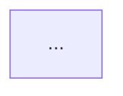

# Documentation Organization Summary

**Omni2 Documentation Structure - January 2026**

---

## 📁 Folder Structure

```
omni2/
├── docs/
│   ├── README.md                    # Main documentation index
│   │
│   ├── architecture/                # System design & architecture
│   │   ├── TRAEFIK_ARCHITECTURE.md # Traefik gateway with mermaid diagrams
│   │   ├── SYSTEM_OVERVIEW.md      # (TODO) High-level architecture
│   │   ├── DATABASE_SCHEMA.md      # (TODO) PostgreSQL schema
│   │   └── AUTHENTICATION_FLOW.md  # (TODO) JWT & ForwardAuth details
│   │
│   ├── security/                    # Security documentation
│   │   ├── SECURITY_OVERVIEW.md    # Multi-layer security approach
│   │   ├── AUTHENTICATION.md       # (TODO) JWT tokens & API keys
│   │   ├── AUTHORIZATION.md        # (TODO) RBAC & permissions
│   │   └── NETWORK_SECURITY.md     # (TODO) IP whitelisting & HTTPS
│   │
│   ├── deployment/                  # Setup & deployment guides
│   │   ├── QUICK_START.md          # 5-minute setup guide
│   │   ├── PRODUCTION_SETUP.md     # (TODO) Production deployment
│   │   ├── ENVIRONMENT_VARIABLES.md # (TODO) Config reference
│   │   └── TROUBLESHOOTING.md      # (TODO) Common issues
│   │
│   ├── mcp-integration/             # MCP integration guides
│   │   ├── ADDING_NEW_MCP.md       # Step-by-step MCP integration
│   │   ├── MCP_CONFIGURATION.md    # (TODO) Settings & auth
│   │   ├── BEST_PRACTICES.md       # (TODO) Design patterns
│   │   └── AVAILABLE_MCPS.md       # (TODO) List of MCPs
│   │
│   ├── development/                 # Developer documentation
│   │   ├── SETUP.md                # (TODO) Local dev environment
│   │   ├── TESTING.md              # (TODO) Test coverage
│   │   ├── API_REFERENCE.md        # (TODO) REST API docs
│   │   └── CONTRIBUTING.md         # (TODO) Contribution guide
│   │
│   └── archive/                     # Old documentation (reference only)
│       ├── AGENTIC_LOOP_IMPLEMENTATION.md
│       ├── CACHE_TEST_RESULTS.md
│       ├── DATABASE_CONSOLIDATION.md
│       ├── DEMO.md
│       ├── MICROSERVICES_ARCHITECTURE.md
│       ├── PERFORMANCE_OPTIMIZATION.md
│       ├── SLACK_INTEGRATION.md
│       ├── SOURCE_TRACKING.md
│       ├── SPEC.md
│       └── TEST_RESULTS.md
│
├── README.md                        # Main project README (updated)
├── ROADMAP.md                       # Project roadmap (keep)
└── RULES.md                         # (TODO) Move to root if needed
```

---

## ✅ Completed Documentation

### Architecture
- ✅ **TRAEFIK_ARCHITECTURE.md** - Complete with mermaid diagrams, authentication flow, routing config, testing results

### Security
- ✅ **SECURITY_OVERVIEW.md** - Multi-layer security, JWT tokens, RBAC, SQL security, audit logging

### Deployment
- ✅ **QUICK_START.md** - 5-minute setup guide with step-by-step instructions

### MCP Integration
- ✅ **ADDING_NEW_MCP.md** - Comprehensive guide with examples, best practices, troubleshooting

### Main Files
- ✅ **docs/README.md** - Documentation index with organized structure
- ✅ **omni2/README.md** - Professional project README with badges, features, architecture

---

## 📝 TODO Documentation

### High Priority
- [ ] **architecture/SYSTEM_OVERVIEW.md** - High-level system design, components, data flow
- [ ] **security/AUTHENTICATION.md** - Detailed JWT implementation, token lifecycle, best practices
- [ ] **security/AUTHORIZATION.md** - RBAC implementation, permission system, examples
- [ ] **deployment/PRODUCTION_SETUP.md** - Production deployment, HTTPS, monitoring, backups
- [ ] **development/API_REFERENCE.md** - REST API endpoints, request/response examples

### Medium Priority
- [ ] **architecture/DATABASE_SCHEMA.md** - PostgreSQL schema, relationships, migrations
- [ ] **architecture/AUTHENTICATION_FLOW.md** - Detailed auth flow with code examples
- [ ] **security/NETWORK_SECURITY.md** - IP whitelisting, firewall rules, VPN setup
- [ ] **deployment/ENVIRONMENT_VARIABLES.md** - Complete config reference
- [ ] **deployment/TROUBLESHOOTING.md** - Common issues, solutions, debug commands
- [ ] **mcp-integration/MCP_CONFIGURATION.md** - MCP settings, auth types, timeouts
- [ ] **mcp-integration/BEST_PRACTICES.md** - Design patterns, performance tips
- [ ] **mcp-integration/AVAILABLE_MCPS.md** - List of integrated MCPs with descriptions

### Low Priority
- [ ] **development/SETUP.md** - Local development environment setup
- [ ] **development/TESTING.md** - Test coverage, running tests, writing tests
- [ ] **development/CONTRIBUTING.md** - Contribution guidelines, code standards
- [ ] **deployment/FAQ.md** - Frequently asked questions

---

## 🎯 Documentation Principles

### 1. **Organization**
- Group by topic (architecture, security, deployment, etc.)
- Use clear, descriptive filenames
- Maintain consistent structure across docs

### 2. **Content**
- Start with overview/summary
- Use diagrams (mermaid) for complex concepts
- Include code examples
- Provide troubleshooting sections
- Link to related docs

### 3. **Maintenance**
- Update docs with code changes
- Archive outdated docs (don't delete)
- Review quarterly for accuracy
- Keep changelog in each doc

### 4. **Style**
- Use markdown formatting
- Include table of contents for long docs
- Use emojis for visual hierarchy
- Keep language clear and concise

---

## 📊 Documentation Metrics

### Current Status
- **Total Docs**: 5 completed, 18 TODO
- **Coverage**: ~22% complete
- **Quality**: High (with diagrams, examples, troubleshooting)
- **Organization**: Excellent (well-structured folders)

### Target Goals
- **Q1 2026**: 80% documentation complete
- **Q2 2026**: 100% documentation complete
- **Ongoing**: Keep docs updated with releases

---

## 🔄 Documentation Workflow

### When Adding New Features
1. Update relevant docs in `docs/` folder
2. Add examples and code snippets
3. Update main README if needed
4. Add to ROADMAP.md if future work

### When Fixing Bugs
1. Update troubleshooting sections
2. Add to FAQ if common issue
3. Update code examples if affected

### When Deprecating Features
1. Move docs to `docs/archive/`
2. Add deprecation notice
3. Update main README
4. Update ROADMAP.md

---

## 📚 Documentation Templates

### New Architecture Doc Template
```markdown
# [Feature Name]

**Brief description**

---

## Overview

High-level explanation

## Architecture Diagram



## Components

Detailed component descriptions

## Configuration

Code examples

## Troubleshooting

Common issues

## References

Links to related docs
```

### New Guide Template
```markdown
# [Guide Title]

**What you'll learn**

---

## Prerequisites

Requirements

## Step 1: [Action]

Instructions with code

## Step 2: [Action]

Instructions with code

## Verification

How to test

## Troubleshooting

Common issues

## Next Steps

What to do next
```

---

## 🆘 Documentation Help

### Need to Update Docs?
1. Find the relevant file in `docs/` folder
2. Edit using markdown
3. Test links and code examples
4. Commit with clear message

### Need to Create New Doc?
1. Choose appropriate folder
2. Use template above
3. Add to `docs/README.md` index
4. Link from related docs

### Questions?
- Check existing docs first
- Ask in #documentation Slack channel
- Create GitHub issue with `documentation` label

---

## 📅 Last Updated

**Date**: January 26, 2026  
**By**: Documentation Team  
**Version**: 1.0.0

---

## ✨ Next Steps

1. **Complete High Priority Docs** - Focus on SYSTEM_OVERVIEW, AUTHENTICATION, AUTHORIZATION
2. **Add Diagrams** - Create mermaid diagrams for all architecture docs
3. **Code Examples** - Add working code examples to all guides
4. **Review & Test** - Verify all links, commands, and examples work
5. **Publish** - Make docs available on GitHub Pages or similar

---

**Documentation is a living project - keep it updated!** 📖
